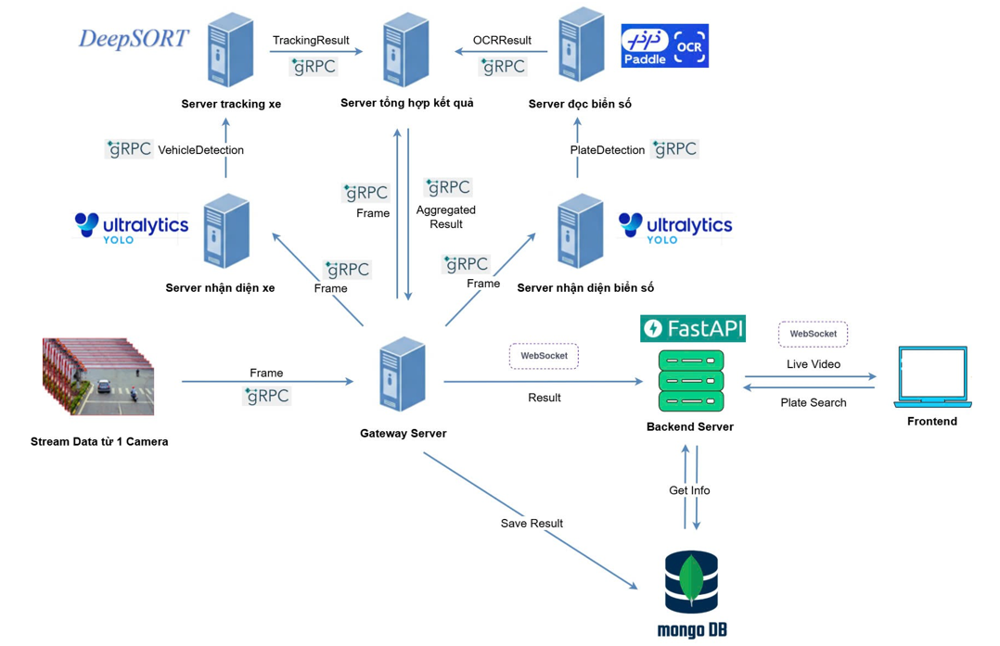

# 🚗 Vehicle License Plate Recognition System

This project is a real-time system for **automatic vehicle license plate detection and recognition**, based on deep learning, OCR, and microservice architecture.

---

## 🏗️ System Architecture Overview

The system is composed of several microservices connected via **gRPC** and **WebSocket**, and supports **real-time video processing**, **object tracking**, and **license plate recognition**.



---

## 🔁 Workflow

1. **Camera Input**  
   A video stream is captured from a surveillance camera and sent to the **Gateway Server**.

2. **Gateway Server**  
   - Splits the stream into individual frames.  
   - Sends frames via **gRPC** to:
     - Vehicle Detection Server
     - Plate Detection Server

3. **Vehicle Detection Server (YOLOv8)**  
   - Uses YOLOv8 to detect vehicles in each frame.  
   - Sends vehicle bounding boxes to the **Tracking Server**.

4. **Tracking Server (DeepSORT)**  
   - Tracks vehicles across frames using DeepSORT.  
   - Outputs results with tracking IDs to the **Result Aggregator Server**.

5. **Plate Detection Server (YOLOv8)**  
   - Detects license plate areas in frames.  
   - Sends plate regions to the **OCR Server**.

6. **OCR Server (PaddleOCR)**  
   - Extracts characters from license plates.  
   - Sends recognized plate numbers to the **Result Aggregator Server**.

7. **Result Aggregator Server**  
   - Merges vehicle tracking data and recognized plate text into one final result per frame.  
   - Sends aggregated results to the **Gateway Server**.

8. **Backend Server (FastAPI)**  
   - Receives results from Gateway via WebSocket.  
   - Saves results to **MongoDB**.
   - Handles frontend queries (e.g., plate search, logs).

9. **Frontend**  
   - Displays real-time video with vehicle and license plate overlays.  
   - Allows search/filtering of historical vehicle data.

---

## 🧰 Technologies Used

| Functionality             | Tool/Library        |
|---------------------------|---------------------|
| Object Detection          | YOLOv8 (Ultralytics)|
| Vehicle Tracking          | DeepSORT            |
| License Plate Recognition | PaddleOCR           |
| Communication             | gRPC, WebSocket     |
| Backend API               | FastAPI             |
| Database                  | MongoDB             |
| Frontend                  | React.js            |

---

## 📦 Microservices List

- `Gateway Server`: Streams video and routes frames.
- `Vehicle Detection Server`: YOLOv8-based vehicle detection.
- `Plate Detection Server`: YOLOv8-based license plate detection.
- `Tracking Server`: DeepSORT vehicle tracker.
- `OCR Server`: PaddleOCR for text recognition.
- `Result Aggregator Server`: Combines all output into unified results.
- `Backend Server`: API and WebSocket hub.
- `Frontend`: Real-time dashboard and search interface.

---

## 🚀 Deployment Instructions

1. **Install dependencies**:
    ```bash
    pip install torch==2.5.1 torchvision==0.20.1 torchaudio==2.5.1 --index-url https://download.pytorch.org/whl/cu118
    pip install paddlepaddle-gpu==2.6.2 -i https://www.paddlepaddle.org.cn/packages/stable/cu118/
    pip install -r requirements.txt
    ```

2. **Start services** in this order:
    - Gateway Server
    - YOLO Servers (vehicle and plate detection)
    - Tracking Server
    - OCR Server
    - Result Aggregator Server
    - Backend (FastAPI)
    - Frontend (React)

3. **Test the system with sample video**:

    Run the following script to simulate a live camera feed using a sample `.mp4` video:

    ```bash
    python test_video_stream.py
    ```

    This script reads the video frame-by-frame and streams it into the system via the Gateway Server.

    Once the system is running, access the dashboard to:

    - View real-time video with bounding boxes and recognized license plates.
    - Monitor vehicle tracking and OCR output.
    - Search license plate logs and view historical data.

---

## 🖼️ Sample Results

Below are example outputs from the system:

### 🔹 Live Video Stream with Bounding Boxes


- Green box: Vehicle detection (YOLOv8 + DeepSORT ID)
- Blue box: License plate region
- Plate number text (PaddleOCR)

### 🔹 License Plate Log Example


### 🔹 Search License Plate


---

## 📜 License

This project is for educational purposes only. Commercial use is not permitted without authorization.